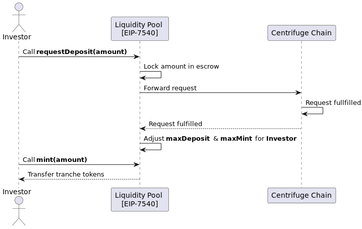

# Investing into a Liquidity Pool

This guide will teach you how to find the correct liquidity pool instance to invest in, how to invest and get the respective tranche tokens in return, and how the whole system flows behind the scenes.

## Deployed Contracts

Pick the contracts deployed on the network you want to invest from.
You will need them on the `Step 2.` below.

- **Ethereum**
    - `PoolManager` - `0x78E9e622A57f70F1E0Ec652A4931E4e278e58142`
    - `Circle USDC` - `0xA0b86991c6218b36c1d19D4a2e9Eb0cE3606eB48`

## Steps

1. ERC20 Approval

    The user should call the ERC20 approval on the investment currency (e.g. USDC on Ethereum) to allow the Liquidity Pools contract to manage those funds for them
    
2. Pick the correct `LiquidityPool` instance
    
    With the appropriate `PoolManager` contract instance, call the following:

    **`PoolManager.getLiquidityPool(poolId, trancheId, currency)`**

    **NOTES**:
    
    - The `currency` param should be the `USDC` token address in the respective network.
    - The `LiquidityPool` offers an interface based on [EIP-7540](https://eips.ethereum.org/EIPS/eip-7540), an extension of [EIP-4626](https://eips.ethereum.org/EIPS/eip-4626)
    
3. Invest into a LiquidityPool

    Now that you have the LiquidityPool instance at hand, you can invest into it by calling:

    **`LiquidityPool.requestDeposit(uint256 amount, address receiver)`**
    
    Once submitted, the `amount` is locked on the escrow contract.
    
    Then, the pool issuer needs to fulfill this request. 
    
    Once that's done, yield starts to accrue immediately and the user can claim their tranche tokens.
    
4. Claim the tranche tokens

    Once the request from step 3. is fulfilled, the user can claim their tranche tokens equivalent to `y` by calling:

    **`LiquidityPool.mint(uint256 y, address receiver)`**
    
    **NOTE**: `y` needs to be ≤ `maxDeposit`. The user can find that amount by calling **`LiquidityPool.maxDeposit`**.

 

## Overview

Behind the scenes, this is what takes place on steps 2 and 3:

