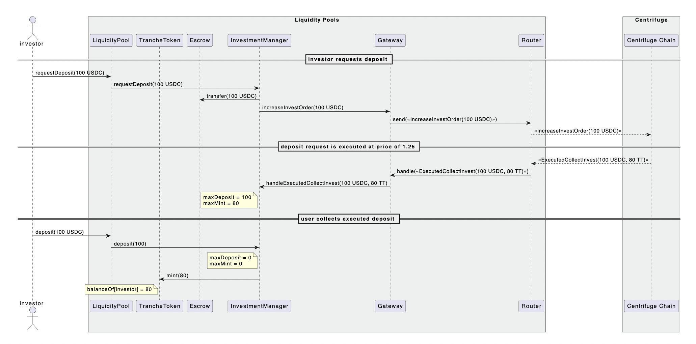

# Investing into a Liquidity Pool

This guide will teach you how to find the correct liquidity pool instance to invest in, how to invest and get the respective tranche tokens in return, and how the whole system flows behind the scenes.

## Deployed Contracts

Pick the `PoolManager` deployed on the network you want to invest from.
You will need it on the `Step 2.` below.

- **Ethereum**
    - `PoolManager` - `0x78E9e622A57f70F1E0Ec652A4931E4e278e58142`

## Steps

1. ERC20 Approval
    The user should call the ERC20 approval on the investment currency (e.g. USDC on Ethereum) to allow the Liquidity Pools contract to manage those funds for them
    
2. Pick the correct Liquidity Pool instance
    - Pick the `PoolManager` contract for the network you want to invest from the [Resources](#Resources) section and then call:
    **`PoolManager.getLiquidityPool(poolId, trancheId, currency)`**
    
3. Invest into a LiquidityPool
    Now that you have the LiquidityPool instance at hand, you can invest into it by calling:

    **`LiquidityPool.requestDeposit(uint256 amount, address owner)`**
    
    Liquidity pools have to request investments from Centrifuge before
    tranche tokens can be minted. The deposit requests are added to the order book
    on the Centrifuge chain. 
    
    Once submitted, the currency is locked on the escrow contract.
    
    When the next epoch is executed on Centrifuge, liquidity pools can proceed with tranche token payouts in case their orders got fulfilled (step 3).
    
4. Receive the tranche tokens
    **`LiquidityPool.function deposit(uint256 y, address receiver)`**
    
    Once the order from step 2 is fulfilled, the user can claim their tranche tokens equivalent to `y` by calling the `deposit(y, receiver)`.
    
    **NOTE**: `y` needs to be ≤ `maxDeposit`. The user can find that amount by calling **`LiquidityPool.maxDeposit`**.

 

## Overview

Behind the scenes, this is what takes place on steps 2 and 3:

