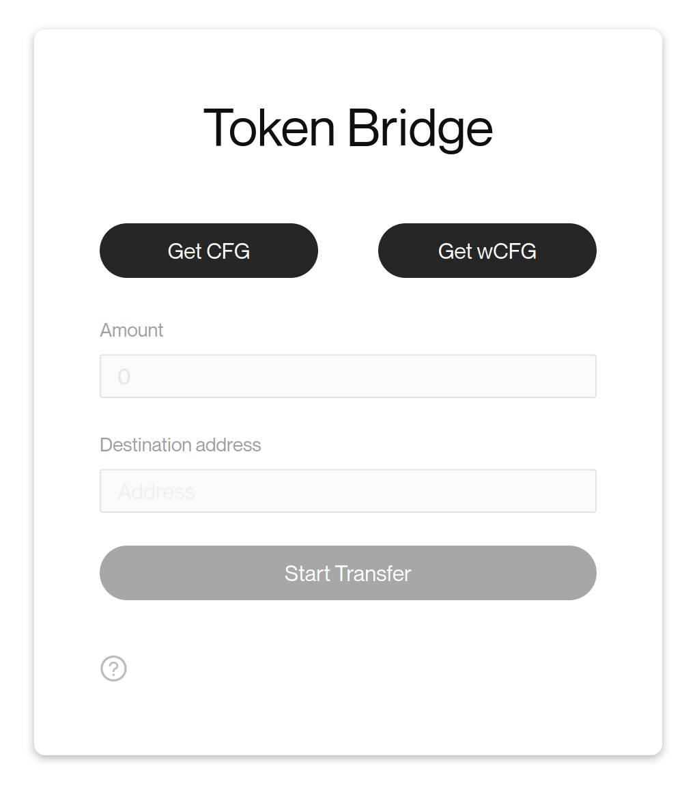
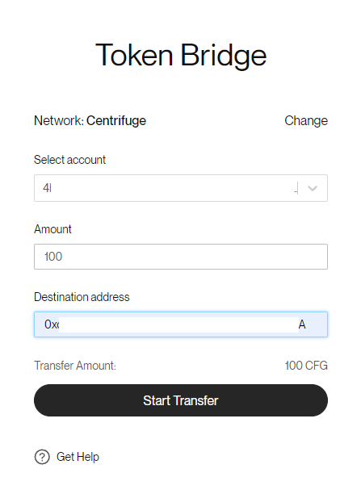
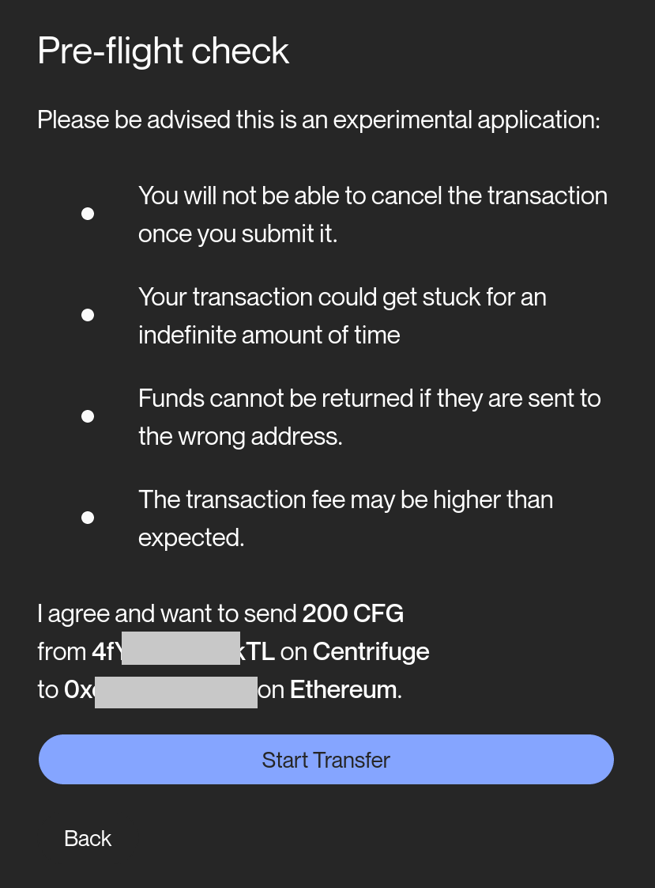
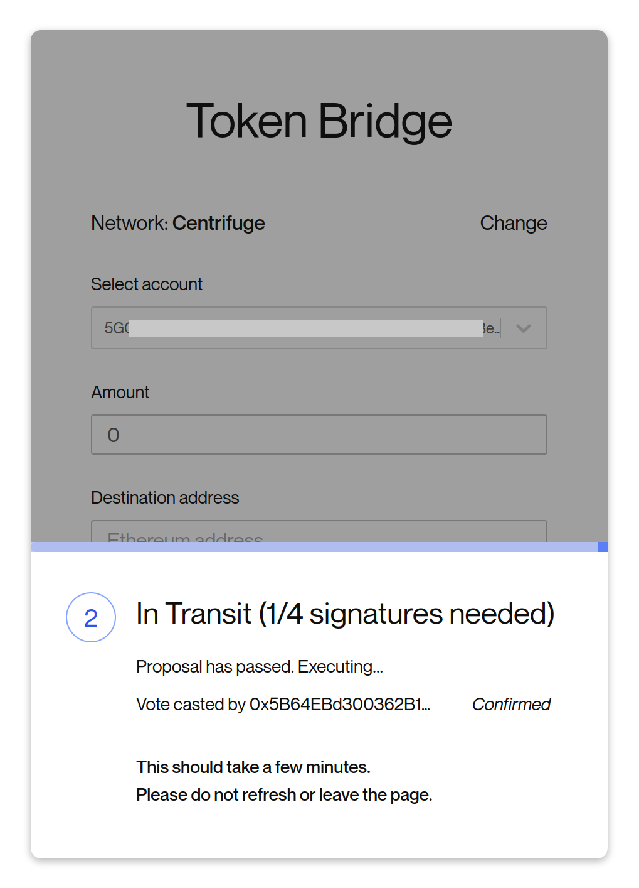

# CFG (Centrifuge) {'\<\>'} CFG (Ethereum) {'\<\>'} CFG (Base)

The **CFG** token lives natively on Centrifuge Chain but can be bridged to Ethereum and used as an ERC20 token, Once on Ethereum, CFG can then be transferred to Base. The ERC20 Token is also called **CFG** on Ethereum and Base has the address `0xc221b7E65FfC80DE234bbB6667aBDd46593D34F0` on Ethereum mainnet and `0x2b51E2Ec9551F9B87B321f63b805871f1c81ba97` on Base mainnet.

## How are CFG on Centrifuge Chain & CFG on Ethereum/Base different?

Each CFG (Ethereum) is backed by one CFG (Centrifuge) locked up in the bridge account on Centrifuge Chain when moved over to Ethereum. You can move between Ethereum and Centrifuge at any time without any restrictions.

Using **CFG on Centrifuge Chain** allows you to:

- Participate in governance
- Pay for fees on Centrifuge Chain

Using **CFG on Ethereum/Base** allows you:

- To interact with DeFi apps that support ERC20 tokens
- Use it within Ethereum and hold it in your Ethereum wallet.

# About the bridge (Centrifuge -> Ethereum)

The bridge used by Centrifuge is a trusted relayer bridge. This means a set of relayers are trusted with relaying messages between Ethereum and Centrifuge chain. When assets are moved between the chains, these relayers pick up the message on Centrifuge Chain and trigger a transaction in Ethereum or vice versa. The bridge is built by [ChainSafe](https://chainsafe.io) in collaboration with Celo, Aragon and ETH Classic. [Read ChainSafe's announcement](https://medium.com/chainsafe-systems/chainsafe-building-chainbridge-49d51ff2e0a2) to learn more about the bridge.

## Bridge Fees

The CFG (Centrifuge) {'\<\>'} CFG (Ethereum) bridge relies on a set of relayers to submit transactions to Ethereum and Centrifuge Chain about the events happening on the other chain. Because these transactions can be very costly at high gas prices, the bridge must charge high enough fees that it will be able to pay for its fees even during times of very high gas prices. For this reason, the fee to go from Centrifuge Chain to Ethereum is relatively high whereas to bridge tokens from Ethereum to Centrifuge chain is cheaper (only the gas fees in gwei on Ethereum have to be paid).

Please note that the CFG (Centrifuge){'\<\>'} CFG (Ethereum) bridging fee costs 100 CFG tokens.

In addition, because Centrifuge Chain does not have any insight into gas prices on Ethereum, there is no way to charge the actual gas spent. The bridge fees are constant and can be changed at any time by the council and are shown to you before you bridge any tokens. There are ways to improve the performance of this in future iterations (batching of transactions, signature aggregation etc.).

## Using the bridge (Centrifuge to Ethereum)

A hosted bridge UI is available at https://bridge.centrifuge.io Navigate over there and you will be presented with two options: **Get CFG on Centrifuge** to move ERC20 CFG to Centrifuge Chain and **Get CFG on Ethereum** to move native CFG to Ethereum. Select which way you would like to use the bridge and the UI will ask you to connect your wallet (either via MetaMask for Ethereum or the Polkadot.js Browser Extension).

Enter the amount you want to transfer (the bridge fee will be deducted automatically) and the destination address (make sure you use the right address format 0xxxx for Ethereum and 4xxx for Centrifuge chain!):

Click on **Start Transfer** and then confirm the transfer:

The bridge relayers now submit your transfer request on chain. After enough confirmations have passed, you will receive the tokens on your target chain (an average transfer takes about 15 minutes. In case of higher traffic in both networks, it can take a little bit longer).

# About the bridge (Ethereum -> Base)

The bridge used by Centrifuge for CFG transfer from Ethereum -> Base leverages Axelar’s interchain service, a decentralized and secure cross-chain communication network, to facilitate seamless transfers between Ethereum and the Base chain. When assets are moved between these chains, Axelar’s network of validators securely relays messages. For instance, when an asset is transferred from Ethereum to Base, Axelar validators detect the transaction on Ethereum and trigger the corresponding transaction on Base, or vice versa. This ensures a trustless, scalable, and efficient bridging solution. Axelar’s interchain service is widely adopted across multiple blockchain ecosystems, making it a reliable choice for cross-chain interoperability. [Learn more about Axelar’s interchain service.](https://www.axelar.network/its)

The setup makes use of the [Mint/Burn Token Manager](https://github.com/axelarnetwork/interchain-token-service/blob/main/contracts/token-manager/TokenManager.sol). Therefore, when transferring CFG from Ethereum to Base, the specified amount is burned on Ethereum and then minted on Base after Axelar's secure cross-chain communication process has completed.

## Using the bridge (Ethereum to Base)

To transfer CFG from Ethereum to Base, you are required to use [Squid Router](https://app.squidrouter.com/).

Squid operates as a cross-chain router, enabling single-click actions such as token swaps, purchases, deposits, and staking across different blockchains. Squid integrates with Axelar’s infrastructure to provide a secure and efficient cross-chain experience.
