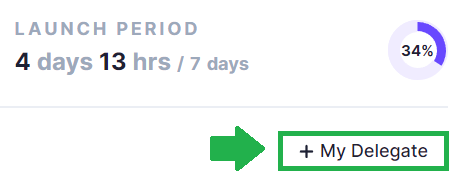

# Delegation and Proxies
There are two ways you can delegate your voting power to another wallet: creating a _Governance Proxy_ or using _Delegation_.

A _Governance Proxy_ is a wallet that can perform governance related tasks on-chain on behalf of another wallet. It is possible to create [different types of proxies](https://wiki.polkadot.network/docs/learn-proxies), but a Governance Proxy specifically only allows for transactions related to governance (i.e. it cannot transfer tokens).

_Delegation_ of tokens is another way of transferring your voting power to another wallet, while maintaining full custody of your tokens. This is very convenient if:

- You want to keep your tokens in a cold wallet and still participate in Governance
- You don't have time to vote but still want to let someone else vote with your tokens actively in Governance
- You don't have enough background knowledge about the proposals and want to delegate your voting power to someone who does

If wallet A delegates tokens to wallet B, then every time wallet B votes in a referendum, it automatically votes with the predetermined amount and conviction from wallet A.

Note that OpenSquare Snapshots do not support delegation, but you can vote with proxies.

## How to create a Governance Proxy

The first step is to [create a hot wallet](https://docs.centrifuge.io/user-documenation/setup-wallet/). You can do that using the [Polkadot.js browser extension](https://polkadot.js.org/extension/). This will be your Governance Proxy.

If your tokens are in a cold wallet (e.g. Parity Signer), you need to import it to the Polkadot.js portal first, using the browser extension. You can find simple instructions on how to do that for Parity Signer [here](https://support.polkadot.network/support/solutions/articles/65000182010-how-to-add-a-parity-signer-account-on-polkadot-js-ui) (use the section _How to add your account through the Polkadot extension_). This way you make your cold wallet hot temporarily while you set up your Governance proxy - make sure to remove it again if you want it to remain cold.

Make sure they are both visible on _Centrifuge_ (not Centrifuge Chain which is the old standalone chain) in the Polkadot.js browser extension.


You should now be able to see both your hot and cold wallet addresses in the Polkadot.js portal under [Accounts](https://polkadot.js.org/apps/?rpc=wss%3A%2F%2Ffullnode.parachain.centrifuge.io#/accounts).


You also need to transfer a small amount of tokens to your proxy to cover transaction fees; a couple of CFG should be more than enough.

Click on the three dots next to your **cold wallet** and select _"Add proxy"_.


1. Select your **hot wallet** as your PROXY ACCOUNT
2. Select **Governance** under TYPE
3. Click **Submit** and **sign the transaction**

It is very important that you select Governance under 2. and not any of the other options to ensure that the proxy wallet only can be used in Governance, and not to transfer tokens or anything else.

Your Governance Proxy is now set up and ready to be used. If you want to keep your cold wallet cold, make sure to remove it from the extension again, by clicking on the three dots next the wallet in the Polkadot.js browser extension and selecting Forget Account.


To remove a proxy, go to the [Accounts](https://polkadot.js.org/apps/?rpc=wss%3A%2F%2Ffullnode.parachain.centrifuge.io#/accounts) section of the portal, find the wallet that created the proxy (use same steps as above to import it again if needed), click on the three dots next to it, select _Manage proxies_, click on the _X_ next to the proxy you want to remove, click _Submit_ and sign the transaction.


## How to delegate

The easiest way to start delegating your tokens is to navigate to [SubSquare](https://centrifuge.subsquare.io/democracy/referenda), log in with the **wallet you want to delegate from**, and click on _+ My Delegate_.




1. The wallet you are **delegating from**
2. Select the wallet you are **delegating to** (select from the list or paste the CFG address)
3. Select the **amount**
4. Select the **conviction**

Whenever 2. votes in an on-chain referendum it will automatically also vote with the amount and conviction specified.

```
If you try to delegate tokens to a wallet that already has voted, the transaction will fail.
```

You should now be able to see your delegation on Subsquare. To remove a delegation, simply click on the _X_ and sign the transaction.


